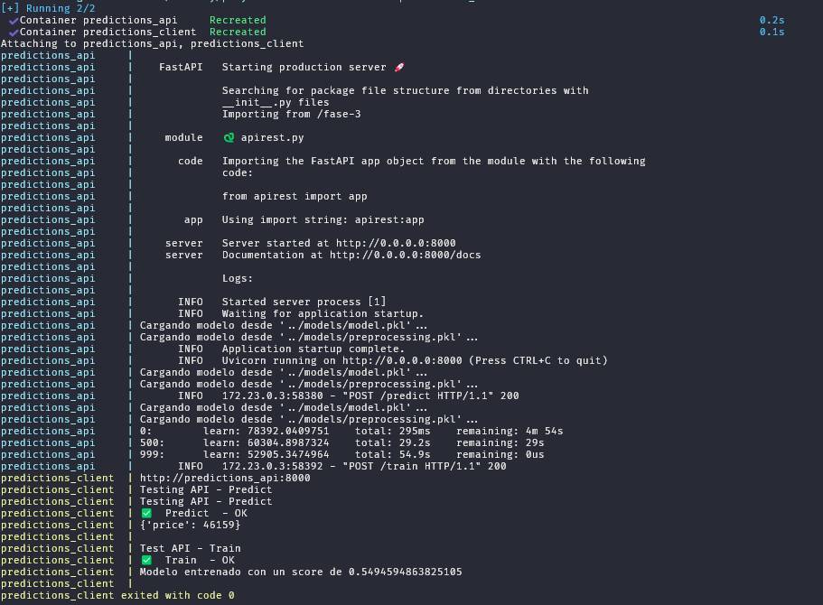

# Proyecto Sustituto - Introdución a la Inteligencia Artificial

## **Integrantes**

- **1041410002** - Jose David Gómez Muñetón
  - Ingeniería de Sistemas
- **1001477904** - Juan Pablo Arango Gaviria
  - Ingeniería de Sistemas

## **Ejecución**

### Fase 1

> [!NOTE]
> La tarea de entrenamiento se puede hacer con tareas en CPU o GPU, para cambiar el dispositivo de entrenamiento se debe modificar la variable `task_type` en el notebook `/fase-1/model.ipynb` en la última celda de la sección #2. En caso de querer entrenar en GPU, se debe cambiar el valor de la variable a `GPU` y debe tener los drivers de CUDA instalados en su máquina.

Para ejecutar la fase 1 del proyecto, se deben ejecutar todas las celdas del notebook `fase-1/model.ipynb`.
Este notebook se encarga de descargar las librerías necesarias, cargar los datos, preprocesarlos, entrenar el modelo con los datos de `/data/train.csv`, evaluarlo y generar las predicciones para el conjunto de prueba (`/data/train.csv`).

### Fase 2 

> [!NOTE]
> Para la ejecucion de esta fase se debe cumplir estos requisitos previos.
> - Tener *Docker* y *Docker Desktop* instalados en tu máquina.
> - *Docker Desktop* debe estar en ejecución antes de realizar cualquier comando relacionado con Docker.


1. El primer paso es construir la imagen Docker que contendrá el entorno y las dependencias necesarias para ejecutar el modelo. Asegúrate de estar en el directorio raíz del proyecto y ejecuta el siguiente comando:

```bash
docker build -t model_ia -f fase-2/Dockerfile .
```

Este comando creará una imagen de Docker llamada `model_ia`.

2. Una vez que hayas creado la imagen, puedes crear y ejecutar un contenedor con la imagen generada:

```bash
docker run --name predicciones model_ia
```

3. Si deseas ver las predicciones generadas de manera local, puedes copiar el archivo `predicts.csv` desde el contenedor a tu máquina local. 
  - Para hacer esto, primero obtén el ID del contenedor, lo encontraras en la primera columna llamada **CONTAINER ID.**

    ```bash
    docker ps -a  
    ```

  - Luego, usa el comando docker cp para copiar el archivo de predicciones:

    ```bash
    docker cp <CONTAINER_ID>:/app/data/predicts.csv ./data/predicts.csv
    ```

    Esto copiará el archivo `predicts.csv` desde el contenedor a la carpeta `data` de tu proyecto local.

### Fase 3

> [!NOTE]
> Para la ejecucion de esta fase se debe cumplir estos requisitos previos.
> - Tener *Docker* y *Docker Desktop* instalados en tu máquina.
> - *Docker Desktop* debe estar en ejecución antes de realizar cualquier comando relacionado con Docker.


### 📄 **Scripts** 

- `apirest.py:` Define una API REST utilizando FastAPI. Incluye dos endpoints: uno para entrenar el modelo  */train*  y otro para realizar predicciones */predict*. El modelo se carga al inicio de la aplicación y se cierra al finalizar.
- `client.py:` Es un cliente para probar la API REST que anteriormente se creo. Genera datos de prueba aleatorios y realiza solicitudes POST a los endpoints */predict* y */train* de la API. Los resultados de las solicitudes se imprimen en la consola, indicando si fueron exitosas o fallidas. 
- `model/__init__.py:` Se define una clase Model que maneja el entrenamiento y la predicción de el modelo utilizando CatBoost. Incluye métodos para cargar, entrenar, predecir y guardar el modelo.
- `model/models.py:` Este script define las dos clases de modelado de los datos. *PredictionData* se utiliza para validar los datos de entrada para las predicciones, mientras que *ModelPrediction* se utiliza para estructurar la respuesta de la predicción. 
- `model/models.py:` Este script contiene una función *cleaning_data* que limpia los datos de entrada llenando los valores faltantes y eliminando los valores atípicos. 

### 🚀 **Ejecución**

El proyecto incluye un archivo `docker-compose.yml` que gestiona la ejecución de los servicios necesarios para probar la API REST.

Para construir las imágenes y ejecutar las predicciones, basta con correr el siguiente comando en la terminal:

```bash
docker-compose up --build
```

📌 **¿Qué hace este comando?**

- Construye las imágenes de la API y el cliente.
- Inicia la API y espera a que esté completamente lista. 
- Una vez que la API está disponible, ejecuta el cliente para realizar las predicciones.
- Al finalizar, en los logs de las llamadas a la API se veran los resultados de la predicción.

